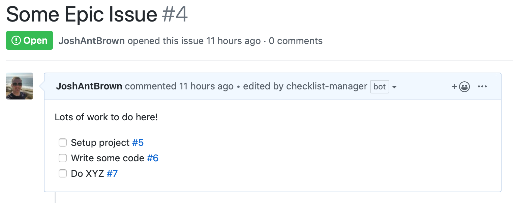
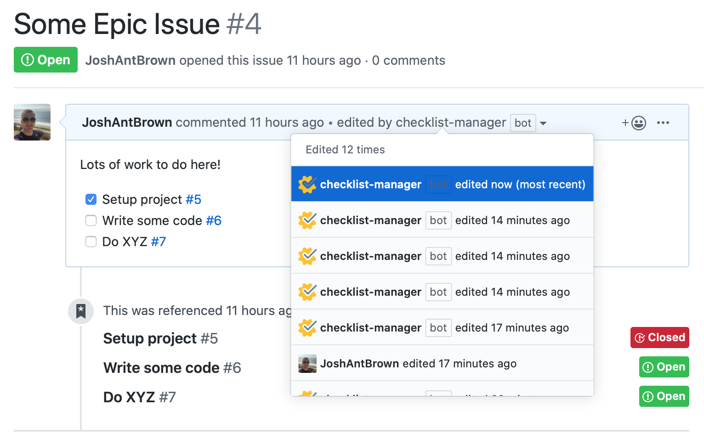

# Checklist Manager

> A GitHub App built with [Probot](https://github.com/probot/probot) that helps you manage checklists of issues and automatically tick them once those issues have been closed.

If you manage a lot of work through GitHub often you'll end up in a situation where you need to track a list of issues in one place. You'll likely end up with an issue that looks something like this:



This quickly becomes painful to manage, issues get closed automatically by PR's but don't get ticked off this list automatically. You're forever looking back and managing these lists. This bot changes that. Every time an issue gets closed or opened it will check any issues that have referenced it for checklists and update them if applicable.



## Setup

```sh
# Install dependencies
npm install

# Run the bot
npm start
```

## Contributing

If you have suggestions for how checklist manager could be improved, or want to report a bug, open an issue! We'd love all and any contributions.

For more, check out the [Contributing Guide](CONTRIBUTING.md).

## License

[ISC](LICENSE) © 2019 Josh Brown <josh@joossh.com>
